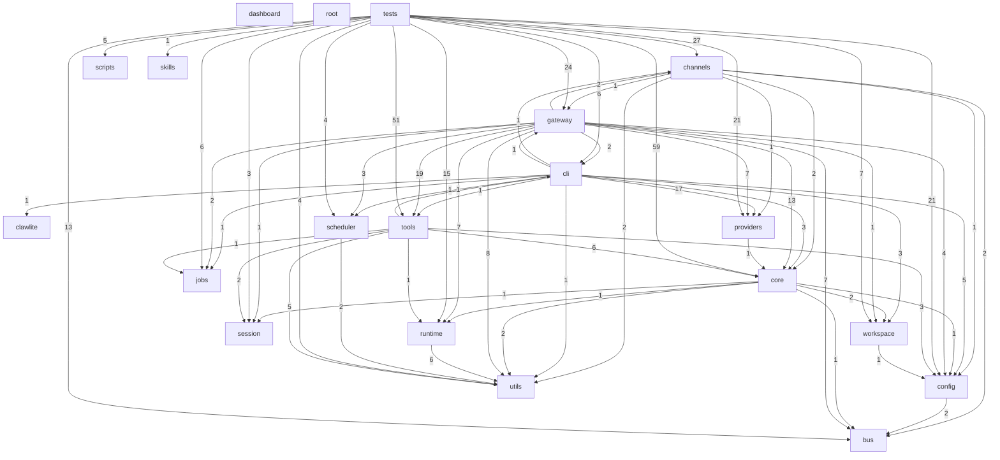
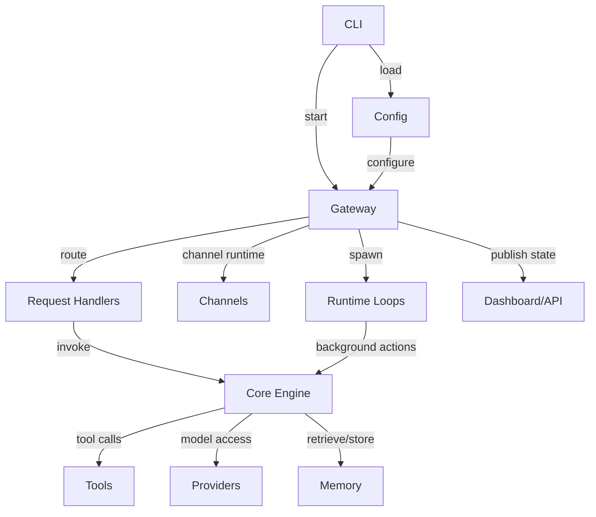
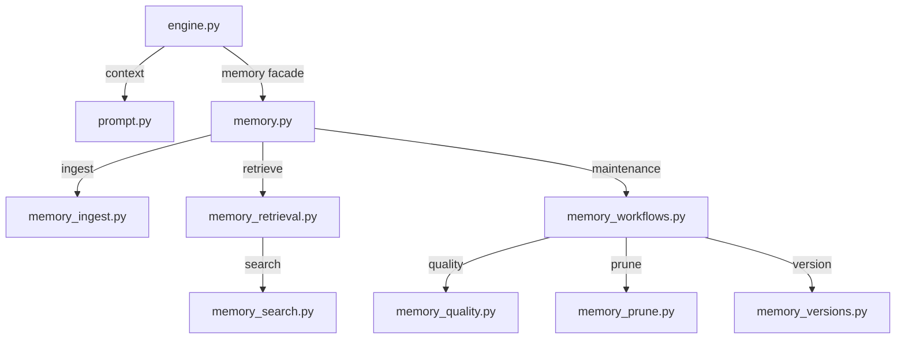
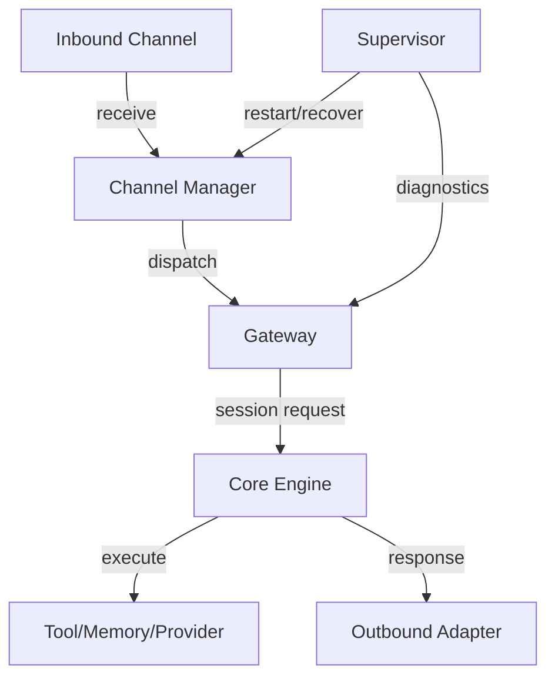

# Architecture Flowcharts

## Subsystem Import Flow

```mermaid
flowchart TD
    A0["bus"]
    A1["channels"]
    A2["clawlite"]
    A3["cli"]
    A4["config"]
    A5["core"]
    A6["dashboard"]
    A7["gateway"]
    A8["jobs"]
    A9["providers"]
    A10["root"]
    A11["runtime"]
    A12["scheduler"]
    A13["scripts"]
    A14["session"]
    A15["skills"]
    A16["tests"]
    A17["tools"]
    A18["utils"]
    A19["workspace"]
    A1 -->|2| A0
    A1 -->|1| A4
    A1 -->|2| A5
    A1 -->|1| A7
    A1 -->|1| A9
    A1 -->|2| A18
    A3 -->|1| A1
    A3 -->|1| A2
    A3 -->|5| A4
    A3 -->|3| A5
    A3 -->|1| A7
    A3 -->|1| A8
    A3 -->|17| A9
    A3 -->|1| A12
    A3 -->|1| A17
    A3 -->|1| A18
    A3 -->|3| A19
    A4 -->|2| A0
    A5 -->|1| A0
    A5 -->|1| A4
    A5 -->|1| A11
    A5 -->|1| A14
    A5 -->|2| A18
    A5 -->|2| A19
    A7 -->|7| A0
    A7 -->|2| A1
    A7 -->|2| A3
    A7 -->|4| A4
    A7 -->|13| A5
    A7 -->|2| A8
    A7 -->|7| A9
    A7 -->|7| A11
    A7 -->|3| A12
    A7 -->|1| A14
    A7 -->|19| A17
    A7 -->|8| A18
    A7 -->|1| A19
    A9 -->|1| A5
    A11 -->|6| A18
    A12 -->|2| A18
    A16 -->|13| A0
    A16 -->|27| A1
    A16 -->|6| A3
    A16 -->|21| A4
    A16 -->|59| A5
    A16 -->|24| A7
    A16 -->|6| A8
    A16 -->|21| A9
    A16 -->|15| A11
    A16 -->|4| A12
    A16 -->|5| A13
    A16 -->|3| A14
    A16 -->|1| A15
    A16 -->|51| A17
    A16 -->|4| A18
    A16 -->|7| A19
    A17 -->|1| A3
    A17 -->|3| A4
    A17 -->|6| A5
    A17 -->|1| A8
    A17 -->|1| A11
    A17 -->|2| A14
    A17 -->|5| A18
    A19 -->|1| A4
```

## Runtime Control Plane

```mermaid
flowchart TD
    G1["CLI"]
    G2["Config"]
    G3["Gateway"]
    G4["Request Handlers"]
    G5["Core Engine"]
    G6["Tools"]
    G7["Providers"]
    G8["Memory"]
    G9["Channels"]
    G10["Runtime Loops"]
    G11["Dashboard/API"]
    G1 -->|load| G2
    G1 -->|start| G3
    G2 -->|configure| G3
    G3 -->|route| G4
    G4 -->|invoke| G5
    G5 -->|tool calls| G6
    G5 -->|model access| G7
    G5 -->|retrieve/store| G8
    G3 -->|channel runtime| G9
    G3 -->|spawn| G10
    G3 -->|publish state| G11
    G10 -->|background actions| G5
```

## Core Memory Cluster

```mermaid
flowchart TD
    M1["engine.py"]
    M2["prompt.py"]
    M3["memory.py"]
    M4["memory_ingest.py"]
    M5["memory_retrieval.py"]
    M6["memory_search.py"]
    M7["memory_workflows.py"]
    M8["memory_quality.py"]
    M9["memory_prune.py"]
    M10["memory_versions.py"]
    M1 -->|context| M2
    M1 -->|memory facade| M3
    M3 -->|ingest| M4
    M3 -->|retrieve| M5
    M5 -->|search| M6
    M3 -->|maintenance| M7
    M7 -->|quality| M8
    M7 -->|prune| M9
    M7 -->|version| M10
```

## Channel and Runtime Flow

```mermaid
flowchart TD
    C1["Inbound Channel"]
    C2["Channel Manager"]
    C3["Gateway"]
    C4["Core Engine"]
    C5["Tool/Memory/Provider"]
    C6["Outbound Adapter"]
    C7["Supervisor"]
    C1 -->|receive| C2
    C2 -->|dispatch| C3
    C3 -->|session request| C4
    C4 -->|execute| C5
    C4 -->|response| C6
    C7 -->|restart/recover| C2
    C7 -->|diagnostics| C3
```
