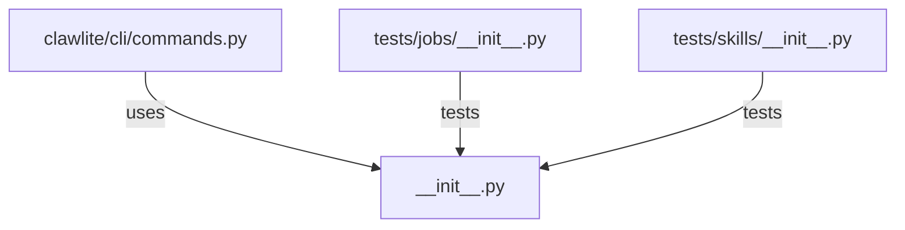

# CONNECTIONS clawlite/__init__.py

## Relationship Summary

- Imports 0 internal file(s).
- Imported by 1 internal file(s).
- Matched test files: 2.

## Reverse Dependencies

- `clawlite/cli/commands.py`

## Matching Tests

- `tests/jobs/__init__.py`
- `tests/skills/__init__.py`

## Mermaid

