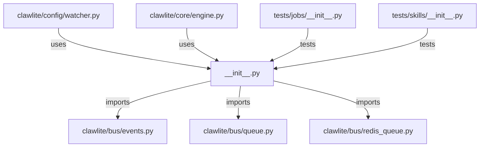

# CONNECTIONS clawlite/bus/__init__.py

## Relationship Summary

- Imports 3 internal file(s).
- Imported by 2 internal file(s).
- Matched test files: 2.

## Internal Imports

- `clawlite/bus/events.py`
- `clawlite/bus/queue.py`
- `clawlite/bus/redis_queue.py`

## Reverse Dependencies

- `clawlite/config/watcher.py`
- `clawlite/core/engine.py`

## Matching Tests

- `tests/jobs/__init__.py`
- `tests/skills/__init__.py`

## Mermaid

