# CONNECTIONS clawlite/bus/events.py

## Relationship Summary

- Imports 0 internal file(s).
- Imported by 17 internal file(s).
- Matched test files: 0.

## Reverse Dependencies

- `clawlite/bus/__init__.py`
- `clawlite/bus/journal.py`
- `clawlite/bus/queue.py`
- `clawlite/bus/redis_queue.py`
- `clawlite/channels/manager.py`
- `clawlite/config/watcher.py`
- `clawlite/gateway/discord_thread_binding.py`
- `clawlite/gateway/self_evolution_approval.py`
- `clawlite/gateway/tool_approval.py`
- `tests/bus/test_journal.py`
- `tests/bus/test_queue.py`
- `tests/bus/test_redis_queue.py`
- `tests/channels/test_manager.py`
- `tests/gateway/test_discord_thread_binding.py`
- `tests/gateway/test_self_evolution_approval.py`
- `tests/gateway/test_server.py`
- `tests/gateway/test_tool_approval.py`

## Mermaid

```mermaid
flowchart TD
    N0["events.py"]
    R1["clawlite/bus/__init__.py"]
    R2["clawlite/bus/journal.py"]
    R3["clawlite/bus/queue.py"]
    R4["clawlite/bus/redis_queue.py"]
    R5["clawlite/channels/manager.py"]
    R6["clawlite/config/watcher.py"]
    R7["clawlite/gateway/discord_thread_binding.py"]
    R8["clawlite/gateway/self_evolution_approval.py"]
    R9["clawlite/gateway/tool_approval.py"]
    R10["tests/bus/test_journal.py"]
    R1 -->|uses| N0
    R2 -->|uses| N0
    R3 -->|uses| N0
    R4 -->|uses| N0
    R5 -->|uses| N0
    R6 -->|uses| N0
    R7 -->|uses| N0
    R8 -->|uses| N0
    R9 -->|uses| N0
    R10 -->|uses| N0
```

