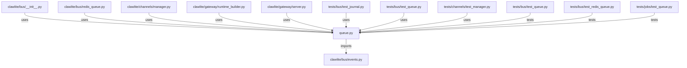

# CONNECTIONS clawlite/bus/queue.py

## Relationship Summary

- Imports 1 internal file(s).
- Imported by 8 internal file(s).
- Matched test files: 3.

## Internal Imports

- `clawlite/bus/events.py`

## Reverse Dependencies

- `clawlite/bus/__init__.py`
- `clawlite/bus/redis_queue.py`
- `clawlite/channels/manager.py`
- `clawlite/gateway/runtime_builder.py`
- `clawlite/gateway/server.py`
- `tests/bus/test_journal.py`
- `tests/bus/test_queue.py`
- `tests/channels/test_manager.py`

## Matching Tests

- `tests/bus/test_queue.py`
- `tests/bus/test_redis_queue.py`
- `tests/jobs/test_queue.py`

## Mermaid

