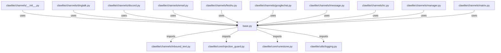

# CONNECTIONS clawlite/channels/base.py

## Relationship Summary

- Imports 4 internal file(s).
- Imported by 20 internal file(s).
- Matched test files: 0.

## Internal Imports

- `clawlite/channels/inbound_text.py`
- `clawlite/core/injection_guard.py`
- `clawlite/core/runestone.py`
- `clawlite/utils/logging.py`

## Reverse Dependencies

- `clawlite/channels/__init__.py`
- `clawlite/channels/dingtalk.py`
- `clawlite/channels/discord.py`
- `clawlite/channels/email.py`
- `clawlite/channels/feishu.py`
- `clawlite/channels/googlechat.py`
- `clawlite/channels/imessage.py`
- `clawlite/channels/irc.py`
- `clawlite/channels/manager.py`
- `clawlite/channels/matrix.py`
- `clawlite/channels/mochat.py`
- `clawlite/channels/qq.py`
- `clawlite/channels/signal.py`
- `clawlite/channels/slack.py`
- `clawlite/channels/telegram.py`
- `clawlite/channels/whatsapp.py`
- `clawlite/gateway/server.py`
- `tests/channels/test_manager.py`
- `tests/channels/test_rate_limiter.py`
- `tests/gateway/test_server.py`

## Mermaid

