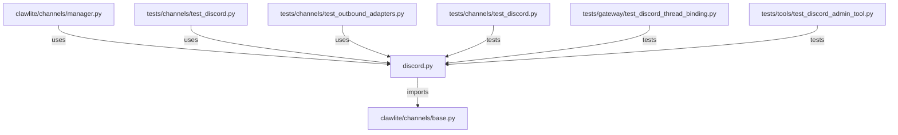

# CONNECTIONS clawlite/channels/discord.py

## Relationship Summary

- Imports 1 internal file(s).
- Imported by 3 internal file(s).
- Matched test files: 3.

## Internal Imports

- `clawlite/channels/base.py`

## Reverse Dependencies

- `clawlite/channels/manager.py`
- `tests/channels/test_discord.py`
- `tests/channels/test_outbound_adapters.py`

## Matching Tests

- `tests/channels/test_discord.py`
- `tests/gateway/test_discord_thread_binding.py`
- `tests/tools/test_discord_admin_tool.py`

## Mermaid

