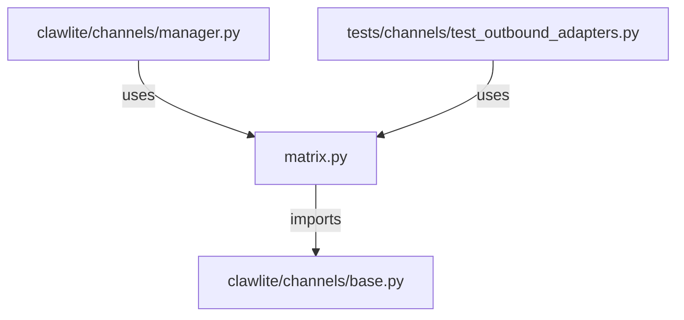

# CONNECTIONS clawlite/channels/matrix.py

## Relationship Summary

- Imports 1 internal file(s).
- Imported by 2 internal file(s).
- Matched test files: 0.

## Internal Imports

- `clawlite/channels/base.py`

## Reverse Dependencies

- `clawlite/channels/manager.py`
- `tests/channels/test_outbound_adapters.py`

## Mermaid

