# CONNECTIONS clawlite/channels/telegram.py

## Relationship Summary

- Imports 16 internal file(s).
- Imported by 5 internal file(s).
- Matched test files: 9.

## Internal Imports

- `clawlite/channels/base.py`
- `clawlite/channels/telegram_aux_updates.py`
- `clawlite/channels/telegram_dedupe.py`
- `clawlite/channels/telegram_delivery.py`
- `clawlite/channels/telegram_inbound_dispatch.py`
- `clawlite/channels/telegram_inbound_message.py`
- `clawlite/channels/telegram_inbound_runtime.py`
- `clawlite/channels/telegram_interactions.py`
- `clawlite/channels/telegram_offset_runtime.py`
- `clawlite/channels/telegram_offset_store.py`
- `clawlite/channels/telegram_outbound.py`
- `clawlite/channels/telegram_pairing.py`
- `clawlite/channels/telegram_status.py`
- `clawlite/channels/telegram_transport.py`
- `clawlite/config/schema.py`
- `clawlite/providers/transcription.py`

## Reverse Dependencies

- `clawlite/channels/__init__.py`
- `clawlite/channels/manager.py`
- `tests/channels/test_telegram.py`
- `tests/channels/test_telegram_inbound_dispatch.py`
- `tests/utils/test_logging.py`

## Matching Tests

- `tests/channels/test_telegram.py`
- `tests/channels/test_telegram_aux_updates.py`
- `tests/channels/test_telegram_delivery.py`
- `tests/channels/test_telegram_inbound_dispatch.py`
- `tests/channels/test_telegram_inbound_message.py`
- `tests/channels/test_telegram_inbound_runtime.py`
- `tests/channels/test_telegram_interactions.py`
- `tests/channels/test_telegram_status.py`
- `tests/channels/test_telegram_transport.py`

## Mermaid

```mermaid
flowchart TD
    N0["telegram.py"]
    D1["clawlite/channels/base.py"]
    D2["clawlite/channels/telegram_aux_updates.py"]
    D3["clawlite/channels/telegram_dedupe.py"]
    D4["clawlite/channels/telegram_delivery.py"]
    D5["clawlite/channels/telegram_inbound_dispatch.py"]
    D6["clawlite/channels/telegram_inbound_message.py"]
    D7["clawlite/channels/telegram_inbound_runtime.py"]
    D8["clawlite/channels/telegram_interactions.py"]
    D9["clawlite/channels/telegram_offset_runtime.py"]
    D10["clawlite/channels/telegram_offset_store.py"]
    R1["clawlite/channels/__init__.py"]
    R2["clawlite/channels/manager.py"]
    R3["tests/channels/test_telegram.py"]
    R4["tests/channels/test_telegram_inbound_dispatch.py"]
    R5["tests/utils/test_logging.py"]
    T1["tests/channels/test_telegram.py"]
    T2["tests/channels/test_telegram_aux_updates.py"]
    T3["tests/channels/test_telegram_delivery.py"]
    T4["tests/channels/test_telegram_inbound_dispatch.py"]
    T5["tests/channels/test_telegram_inbound_message.py"]
    T6["tests/channels/test_telegram_inbound_runtime.py"]
    T7["tests/channels/test_telegram_interactions.py"]
    T8["tests/channels/test_telegram_status.py"]
    T9["tests/channels/test_telegram_transport.py"]
    N0 -->|imports| D1
    N0 -->|imports| D2
    N0 -->|imports| D3
    N0 -->|imports| D4
    N0 -->|imports| D5
    N0 -->|imports| D6
    N0 -->|imports| D7
    N0 -->|imports| D8
    N0 -->|imports| D9
    N0 -->|imports| D10
    R1 -->|uses| N0
    R2 -->|uses| N0
    R3 -->|uses| N0
    R4 -->|uses| N0
    R5 -->|uses| N0
    T1 -->|tests| N0
    T2 -->|tests| N0
    T3 -->|tests| N0
    T4 -->|tests| N0
    T5 -->|tests| N0
    T6 -->|tests| N0
    T7 -->|tests| N0
    T8 -->|tests| N0
    T9 -->|tests| N0
```

