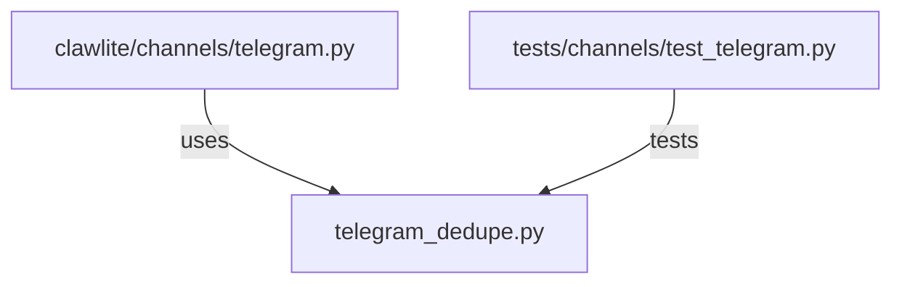

# CONNECTIONS clawlite/channels/telegram_dedupe.py

## Relationship Summary

- Imports 0 internal file(s).
- Imported by 1 internal file(s).
- Matched test files: 1.

## Reverse Dependencies

- `clawlite/channels/telegram.py`

## Matching Tests

- `tests/channels/test_telegram.py`

## Mermaid

