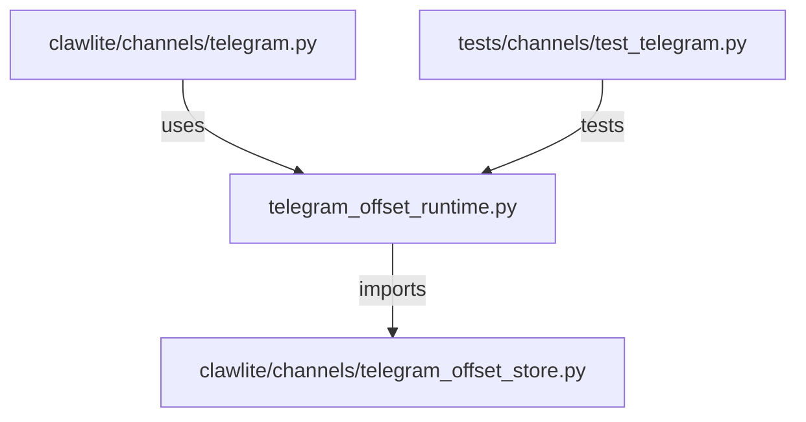

# CONNECTIONS clawlite/channels/telegram_offset_runtime.py

## Relationship Summary

- Imports 1 internal file(s).
- Imported by 1 internal file(s).
- Matched test files: 1.

## Internal Imports

- `clawlite/channels/telegram_offset_store.py`

## Reverse Dependencies

- `clawlite/channels/telegram.py`

## Matching Tests

- `tests/channels/test_telegram.py`

## Mermaid

