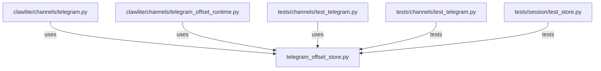

# CONNECTIONS clawlite/channels/telegram_offset_store.py

## Relationship Summary

- Imports 0 internal file(s).
- Imported by 3 internal file(s).
- Matched test files: 2.

## Reverse Dependencies

- `clawlite/channels/telegram.py`
- `clawlite/channels/telegram_offset_runtime.py`
- `tests/channels/test_telegram.py`

## Matching Tests

- `tests/channels/test_telegram.py`
- `tests/session/test_store.py`

## Mermaid

