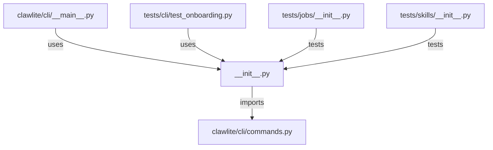

# CONNECTIONS clawlite/cli/__init__.py

## Relationship Summary

- Imports 1 internal file(s).
- Imported by 2 internal file(s).
- Matched test files: 2.

## Internal Imports

- `clawlite/cli/commands.py`

## Reverse Dependencies

- `clawlite/cli/__main__.py`
- `tests/cli/test_onboarding.py`

## Matching Tests

- `tests/jobs/__init__.py`
- `tests/skills/__init__.py`

## Mermaid

