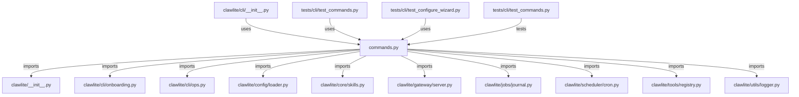

# CONNECTIONS clawlite/cli/commands.py

## Relationship Summary

- Imports 11 internal file(s).
- Imported by 3 internal file(s).
- Matched test files: 1.

## Internal Imports

- `clawlite/__init__.py`
- `clawlite/cli/onboarding.py`
- `clawlite/cli/ops.py`
- `clawlite/config/loader.py`
- `clawlite/core/skills.py`
- `clawlite/gateway/server.py`
- `clawlite/jobs/journal.py`
- `clawlite/scheduler/cron.py`
- `clawlite/tools/registry.py`
- `clawlite/utils/logger.py`
- `clawlite/workspace/loader.py`

## Reverse Dependencies

- `clawlite/cli/__init__.py`
- `tests/cli/test_commands.py`
- `tests/cli/test_configure_wizard.py`

## Matching Tests

- `tests/cli/test_commands.py`

## Mermaid

