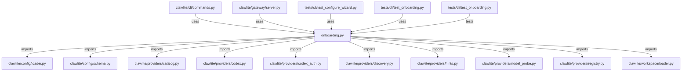

# CONNECTIONS clawlite/cli/onboarding.py

## Relationship Summary

- Imports 10 internal file(s).
- Imported by 4 internal file(s).
- Matched test files: 1.

## Internal Imports

- `clawlite/config/loader.py`
- `clawlite/config/schema.py`
- `clawlite/providers/catalog.py`
- `clawlite/providers/codex.py`
- `clawlite/providers/codex_auth.py`
- `clawlite/providers/discovery.py`
- `clawlite/providers/hints.py`
- `clawlite/providers/model_probe.py`
- `clawlite/providers/registry.py`
- `clawlite/workspace/loader.py`

## Reverse Dependencies

- `clawlite/cli/commands.py`
- `clawlite/gateway/server.py`
- `tests/cli/test_configure_wizard.py`
- `tests/cli/test_onboarding.py`

## Matching Tests

- `tests/cli/test_onboarding.py`

## Mermaid

