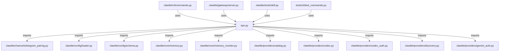

# CONNECTIONS clawlite/cli/ops.py

## Relationship Summary

- Imports 16 internal file(s).
- Imported by 4 internal file(s).
- Matched test files: 0.

## Internal Imports

- `clawlite/channels/telegram_pairing.py`
- `clawlite/config/loader.py`
- `clawlite/config/schema.py`
- `clawlite/core/memory.py`
- `clawlite/core/memory_monitor.py`
- `clawlite/providers/catalog.py`
- `clawlite/providers/codex.py`
- `clawlite/providers/codex_auth.py`
- `clawlite/providers/discovery.py`
- `clawlite/providers/gemini_auth.py`
- `clawlite/providers/hints.py`
- `clawlite/providers/model_probe.py`
- `clawlite/providers/qwen_auth.py`
- `clawlite/providers/registry.py`
- `clawlite/providers/reliability.py`
- `clawlite/workspace/loader.py`

## Reverse Dependencies

- `clawlite/cli/commands.py`
- `clawlite/gateway/server.py`
- `clawlite/tools/skill.py`
- `tests/cli/test_commands.py`

## Mermaid

