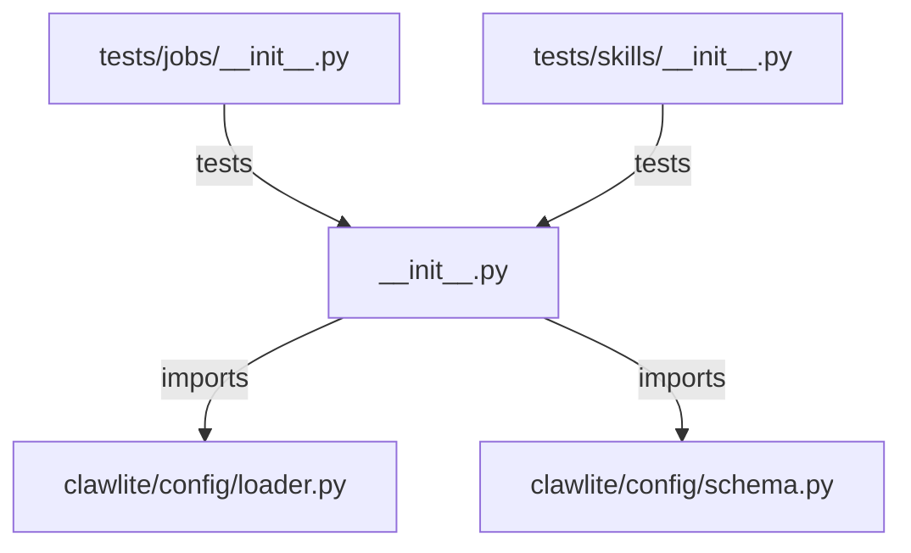

# CONNECTIONS clawlite/config/__init__.py

## Relationship Summary

- Imports 2 internal file(s).
- Imported by 0 internal file(s).
- Matched test files: 2.

## Internal Imports

- `clawlite/config/loader.py`
- `clawlite/config/schema.py`

## Matching Tests

- `tests/jobs/__init__.py`
- `tests/skills/__init__.py`

## Mermaid

