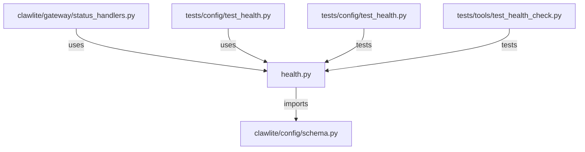

# CONNECTIONS clawlite/config/health.py

## Relationship Summary

- Imports 1 internal file(s).
- Imported by 2 internal file(s).
- Matched test files: 2.

## Internal Imports

- `clawlite/config/schema.py`

## Reverse Dependencies

- `clawlite/gateway/status_handlers.py`
- `tests/config/test_health.py`

## Matching Tests

- `tests/config/test_health.py`
- `tests/tools/test_health_check.py`

## Mermaid

