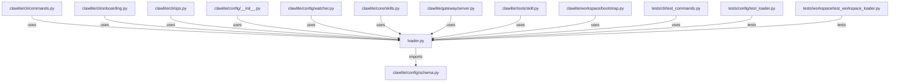

# CONNECTIONS clawlite/config/loader.py

## Relationship Summary

- Imports 1 internal file(s).
- Imported by 14 internal file(s).
- Matched test files: 2.

## Internal Imports

- `clawlite/config/schema.py`

## Reverse Dependencies

- `clawlite/cli/commands.py`
- `clawlite/cli/onboarding.py`
- `clawlite/cli/ops.py`
- `clawlite/config/__init__.py`
- `clawlite/config/watcher.py`
- `clawlite/core/skills.py`
- `clawlite/gateway/server.py`
- `clawlite/tools/skill.py`
- `clawlite/workspace/bootstrap.py`
- `tests/cli/test_commands.py`
- `tests/config/test_loader.py`
- `tests/config/test_schema.py`
- `tests/config/test_watcher.py`
- `tests/workspace/test_workspace_loader.py`

## Matching Tests

- `tests/config/test_loader.py`
- `tests/workspace/test_workspace_loader.py`

## Mermaid

