# CONNECTIONS clawlite/config/schema.py

## Relationship Summary

- Imports 0 internal file(s).
- Imported by 26 internal file(s).
- Matched test files: 1.

## Reverse Dependencies

- `clawlite/channels/telegram.py`
- `clawlite/cli/onboarding.py`
- `clawlite/cli/ops.py`
- `clawlite/config/__init__.py`
- `clawlite/config/audit.py`
- `clawlite/config/health.py`
- `clawlite/config/loader.py`
- `clawlite/config/watcher.py`
- `clawlite/gateway/runtime_builder.py`
- `clawlite/gateway/server.py`
- `clawlite/tools/mcp.py`
- `clawlite/tools/registry.py`
- `tests/cli/test_configure_wizard.py`
- `tests/cli/test_onboarding.py`
- `tests/config/test_health.py`
- `tests/config/test_loader.py`
- `tests/config/test_schema.py`
- `tests/config/test_watcher.py`
- `tests/core/test_engine.py`
- `tests/gateway/test_lifecycle_runtime.py`
- `tests/gateway/test_server.py`
- `tests/tools/test_health_check.py`
- `tests/tools/test_mcp.py`
- `tests/tools/test_registry.py`
- `tests/tools/test_skill_tool.py`
- `tests/workspace/test_workspace_loader.py`

## Matching Tests

- `tests/config/test_schema.py`

## Mermaid

```mermaid
flowchart TD
    N0["schema.py"]
    R1["clawlite/channels/telegram.py"]
    R2["clawlite/cli/onboarding.py"]
    R3["clawlite/cli/ops.py"]
    R4["clawlite/config/__init__.py"]
    R5["clawlite/config/audit.py"]
    R6["clawlite/config/health.py"]
    R7["clawlite/config/loader.py"]
    R8["clawlite/config/watcher.py"]
    R9["clawlite/gateway/runtime_builder.py"]
    R10["clawlite/gateway/server.py"]
    T1["tests/config/test_schema.py"]
    R1 -->|uses| N0
    R2 -->|uses| N0
    R3 -->|uses| N0
    R4 -->|uses| N0
    R5 -->|uses| N0
    R6 -->|uses| N0
    R7 -->|uses| N0
    R8 -->|uses| N0
    R9 -->|uses| N0
    R10 -->|uses| N0
    T1 -->|tests| N0
```

