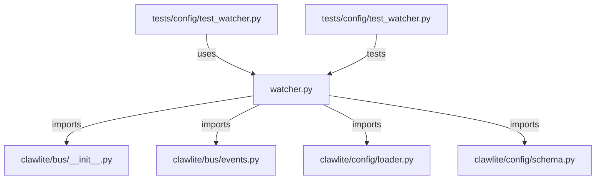

# CONNECTIONS clawlite/config/watcher.py

## Relationship Summary

- Imports 4 internal file(s).
- Imported by 1 internal file(s).
- Matched test files: 1.

## Internal Imports

- `clawlite/bus/__init__.py`
- `clawlite/bus/events.py`
- `clawlite/config/loader.py`
- `clawlite/config/schema.py`

## Reverse Dependencies

- `tests/config/test_watcher.py`

## Matching Tests

- `tests/config/test_watcher.py`

## Mermaid

