# CONNECTIONS clawlite/core/engine.py

## Relationship Summary

- Imports 12 internal file(s).
- Imported by 9 internal file(s).
- Matched test files: 2.

## Internal Imports

- `clawlite/bus/__init__.py`
- `clawlite/core/context_window.py`
- `clawlite/core/injection_guard.py`
- `clawlite/core/memory.py`
- `clawlite/core/prompt.py`
- `clawlite/core/skills.py`
- `clawlite/core/subagent.py`
- `clawlite/core/subagent_synthesizer.py`
- `clawlite/runtime/telemetry.py`
- `clawlite/session/store.py`
- `clawlite/utils/logging.py`
- `clawlite/workspace/identity_enforcer.py`

## Reverse Dependencies

- `clawlite/gateway/runtime_builder.py`
- `clawlite/gateway/server.py`
- `clawlite/providers/litellm.py`
- `tests/channels/test_discord.py`
- `tests/channels/test_telegram.py`
- `tests/core/test_engine.py`
- `tests/gateway/test_server.py`
- `tests/gateway/test_websocket_handlers.py`
- `tests/providers/test_streaming_recovery.py`

## Matching Tests

- `tests/core/test_engine.py`
- `tests/gateway/test_engine_diagnostics.py`

## Mermaid

```mermaid
flowchart TD
    N0["engine.py"]
    D1["clawlite/bus/__init__.py"]
    D2["clawlite/core/context_window.py"]
    D3["clawlite/core/injection_guard.py"]
    D4["clawlite/core/memory.py"]
    D5["clawlite/core/prompt.py"]
    D6["clawlite/core/skills.py"]
    D7["clawlite/core/subagent.py"]
    D8["clawlite/core/subagent_synthesizer.py"]
    D9["clawlite/runtime/telemetry.py"]
    D10["clawlite/session/store.py"]
    R1["clawlite/gateway/runtime_builder.py"]
    R2["clawlite/gateway/server.py"]
    R3["clawlite/providers/litellm.py"]
    R4["tests/channels/test_discord.py"]
    R5["tests/channels/test_telegram.py"]
    R6["tests/core/test_engine.py"]
    R7["tests/gateway/test_server.py"]
    R8["tests/gateway/test_websocket_handlers.py"]
    R9["tests/providers/test_streaming_recovery.py"]
    T1["tests/core/test_engine.py"]
    T2["tests/gateway/test_engine_diagnostics.py"]
    N0 -->|imports| D1
    N0 -->|imports| D2
    N0 -->|imports| D3
    N0 -->|imports| D4
    N0 -->|imports| D5
    N0 -->|imports| D6
    N0 -->|imports| D7
    N0 -->|imports| D8
    N0 -->|imports| D9
    N0 -->|imports| D10
    R1 -->|uses| N0
    R2 -->|uses| N0
    R3 -->|uses| N0
    R4 -->|uses| N0
    R5 -->|uses| N0
    R6 -->|uses| N0
    R7 -->|uses| N0
    R8 -->|uses| N0
    R9 -->|uses| N0
    T1 -->|tests| N0
    T2 -->|tests| N0
```

