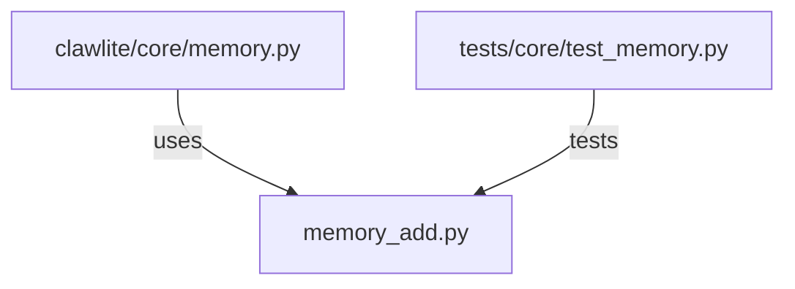

# CONNECTIONS clawlite/core/memory_add.py

## Relationship Summary

- Imports 0 internal file(s).
- Imported by 1 internal file(s).
- Matched test files: 1.

## Reverse Dependencies

- `clawlite/core/memory.py`

## Matching Tests

- `tests/core/test_memory.py`

## Mermaid

