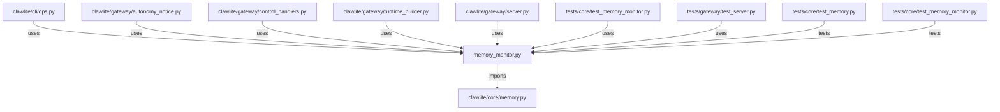

# CONNECTIONS clawlite/core/memory_monitor.py

## Relationship Summary

- Imports 1 internal file(s).
- Imported by 7 internal file(s).
- Matched test files: 2.

## Internal Imports

- `clawlite/core/memory.py`

## Reverse Dependencies

- `clawlite/cli/ops.py`
- `clawlite/gateway/autonomy_notice.py`
- `clawlite/gateway/control_handlers.py`
- `clawlite/gateway/runtime_builder.py`
- `clawlite/gateway/server.py`
- `tests/core/test_memory_monitor.py`
- `tests/gateway/test_server.py`

## Matching Tests

- `tests/core/test_memory.py`
- `tests/core/test_memory_monitor.py`

## Mermaid

