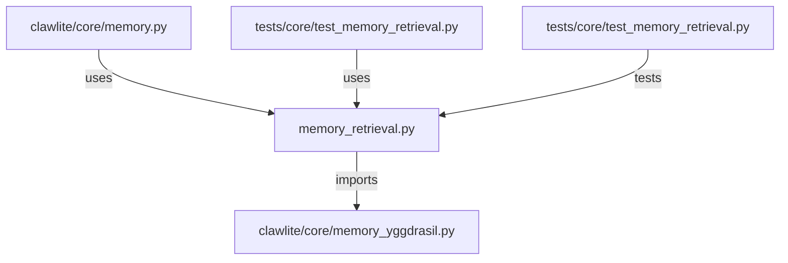

# CONNECTIONS clawlite/core/memory_retrieval.py

## Relationship Summary

- Imports 1 internal file(s).
- Imported by 2 internal file(s).
- Matched test files: 1.

## Internal Imports

- `clawlite/core/memory_yggdrasil.py`

## Reverse Dependencies

- `clawlite/core/memory.py`
- `tests/core/test_memory_retrieval.py`

## Matching Tests

- `tests/core/test_memory_retrieval.py`

## Mermaid

