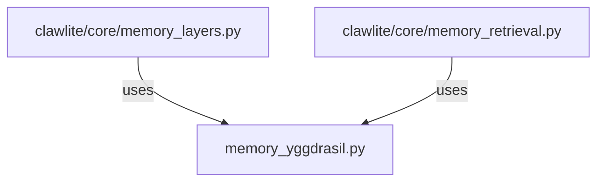

# CONNECTIONS clawlite/core/memory_yggdrasil.py

## Relationship Summary

- Imports 0 internal file(s).
- Imported by 2 internal file(s).
- Matched test files: 0.

## Reverse Dependencies

- `clawlite/core/memory_layers.py`
- `clawlite/core/memory_retrieval.py`

## Mermaid

