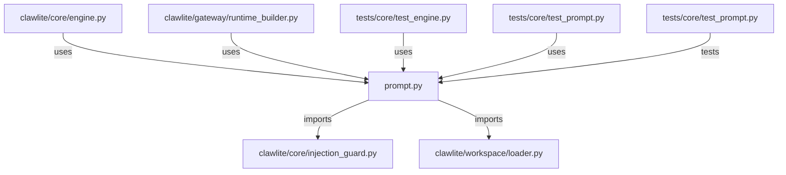

# CONNECTIONS clawlite/core/prompt.py

## Relationship Summary

- Imports 2 internal file(s).
- Imported by 4 internal file(s).
- Matched test files: 1.

## Internal Imports

- `clawlite/core/injection_guard.py`
- `clawlite/workspace/loader.py`

## Reverse Dependencies

- `clawlite/core/engine.py`
- `clawlite/gateway/runtime_builder.py`
- `tests/core/test_engine.py`
- `tests/core/test_prompt.py`

## Matching Tests

- `tests/core/test_prompt.py`

## Mermaid

