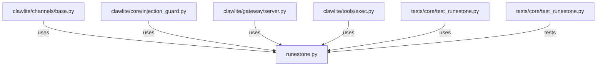

# CONNECTIONS clawlite/core/runestone.py

## Relationship Summary

- Imports 0 internal file(s).
- Imported by 5 internal file(s).
- Matched test files: 1.

## Reverse Dependencies

- `clawlite/channels/base.py`
- `clawlite/core/injection_guard.py`
- `clawlite/gateway/server.py`
- `clawlite/tools/exec.py`
- `tests/core/test_runestone.py`

## Matching Tests

- `tests/core/test_runestone.py`

## Mermaid

