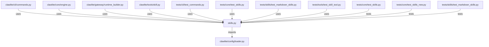

# CONNECTIONS clawlite/core/skills.py

## Relationship Summary

- Imports 1 internal file(s).
- Imported by 8 internal file(s).
- Matched test files: 3.

## Internal Imports

- `clawlite/config/loader.py`

## Reverse Dependencies

- `clawlite/cli/commands.py`
- `clawlite/core/engine.py`
- `clawlite/gateway/runtime_builder.py`
- `clawlite/tools/skill.py`
- `tests/cli/test_commands.py`
- `tests/core/test_skills.py`
- `tests/skills/test_markdown_skills.py`
- `tests/tools/test_skill_tool.py`

## Matching Tests

- `tests/core/test_skills.py`
- `tests/core/test_skills_new.py`
- `tests/skills/test_markdown_skills.py`

## Mermaid

