# CONNECTIONS clawlite/core/subagent.py

## Relationship Summary

- Imports 0 internal file(s).
- Imported by 11 internal file(s).
- Matched test files: 3.

## Reverse Dependencies

- `clawlite/core/engine.py`
- `clawlite/tools/agents.py`
- `clawlite/tools/sessions.py`
- `clawlite/tools/spawn.py`
- `tests/core/test_engine.py`
- `tests/core/test_subagent.py`
- `tests/core/test_subagent_context.py`
- `tests/gateway/test_server.py`
- `tests/tools/test_agents_tool.py`
- `tests/tools/test_cron_message_spawn_mcp.py`
- `tests/tools/test_sessions_tools.py`

## Matching Tests

- `tests/core/test_subagent.py`
- `tests/core/test_subagent_context.py`
- `tests/gateway/test_subagents_runtime.py`

## Mermaid

```mermaid
flowchart TD
    N0["subagent.py"]
    R1["clawlite/core/engine.py"]
    R2["clawlite/tools/agents.py"]
    R3["clawlite/tools/sessions.py"]
    R4["clawlite/tools/spawn.py"]
    R5["tests/core/test_engine.py"]
    R6["tests/core/test_subagent.py"]
    R7["tests/core/test_subagent_context.py"]
    R8["tests/gateway/test_server.py"]
    R9["tests/tools/test_agents_tool.py"]
    R10["tests/tools/test_cron_message_spawn_mcp.py"]
    T1["tests/core/test_subagent.py"]
    T2["tests/core/test_subagent_context.py"]
    T3["tests/gateway/test_subagents_runtime.py"]
    R1 -->|uses| N0
    R2 -->|uses| N0
    R3 -->|uses| N0
    R4 -->|uses| N0
    R5 -->|uses| N0
    R6 -->|uses| N0
    R7 -->|uses| N0
    R8 -->|uses| N0
    R9 -->|uses| N0
    R10 -->|uses| N0
    T1 -->|tests| N0
    T2 -->|tests| N0
    T3 -->|tests| N0
```

