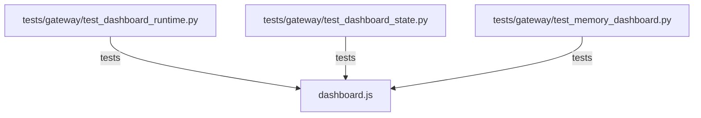

# CONNECTIONS clawlite/dashboard/dashboard.js

## Relationship Summary

- Imports 0 internal file(s).
- Imported by 0 internal file(s).
- Matched test files: 3.

## Matching Tests

- `tests/gateway/test_dashboard_runtime.py`
- `tests/gateway/test_dashboard_state.py`
- `tests/gateway/test_memory_dashboard.py`

## Mermaid

