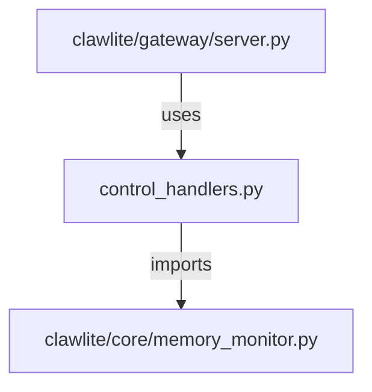

# CONNECTIONS clawlite/gateway/control_handlers.py

## Relationship Summary

- Imports 1 internal file(s).
- Imported by 1 internal file(s).
- Matched test files: 0.

## Internal Imports

- `clawlite/core/memory_monitor.py`

## Reverse Dependencies

- `clawlite/gateway/server.py`

## Mermaid

