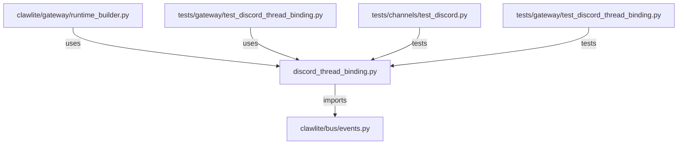

# CONNECTIONS clawlite/gateway/discord_thread_binding.py

## Relationship Summary

- Imports 1 internal file(s).
- Imported by 2 internal file(s).
- Matched test files: 2.

## Internal Imports

- `clawlite/bus/events.py`

## Reverse Dependencies

- `clawlite/gateway/runtime_builder.py`
- `tests/gateway/test_discord_thread_binding.py`

## Matching Tests

- `tests/channels/test_discord.py`
- `tests/gateway/test_discord_thread_binding.py`

## Mermaid

