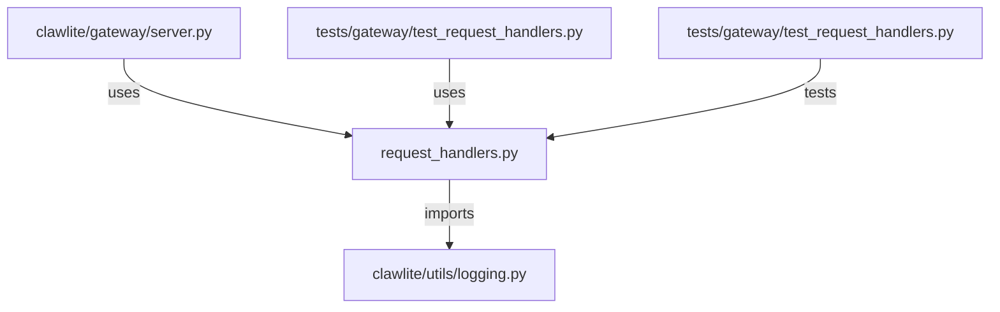

# CONNECTIONS clawlite/gateway/request_handlers.py

## Relationship Summary

- Imports 1 internal file(s).
- Imported by 2 internal file(s).
- Matched test files: 1.

## Internal Imports

- `clawlite/utils/logging.py`

## Reverse Dependencies

- `clawlite/gateway/server.py`
- `tests/gateway/test_request_handlers.py`

## Matching Tests

- `tests/gateway/test_request_handlers.py`

## Mermaid

