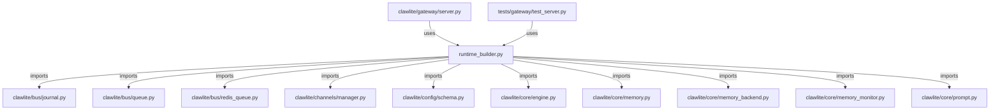

# CONNECTIONS clawlite/gateway/runtime_builder.py

## Relationship Summary

- Imports 46 internal file(s).
- Imported by 2 internal file(s).
- Matched test files: 0.

## Internal Imports

- `clawlite/bus/journal.py`
- `clawlite/bus/queue.py`
- `clawlite/bus/redis_queue.py`
- `clawlite/channels/manager.py`
- `clawlite/config/schema.py`
- `clawlite/core/engine.py`
- `clawlite/core/memory.py`
- `clawlite/core/memory_backend.py`
- `clawlite/core/memory_monitor.py`
- `clawlite/core/prompt.py`
- `clawlite/core/skills.py`
- `clawlite/gateway/autonomy_notice.py`
- `clawlite/gateway/discord_thread_binding.py`
- `clawlite/gateway/self_evolution_approval.py`
- `clawlite/gateway/tool_approval.py`
- `clawlite/jobs/journal.py`
- `clawlite/jobs/queue.py`
- `clawlite/providers/__init__.py`
- `clawlite/providers/discovery.py`
- `clawlite/runtime/__init__.py`
- `clawlite/runtime/self_evolution.py`
- `clawlite/runtime/telemetry.py`
- `clawlite/scheduler/cron.py`
- `clawlite/scheduler/heartbeat.py`
- `clawlite/session/store.py`
- `clawlite/tools/agents.py`
- `clawlite/tools/apply_patch.py`
- `clawlite/tools/browser.py`
- `clawlite/tools/cron.py`
- `clawlite/tools/discord_admin.py`
- `clawlite/tools/exec.py`
- `clawlite/tools/files.py`
- `clawlite/tools/jobs.py`
- `clawlite/tools/mcp.py`
- `clawlite/tools/memory.py`
- `clawlite/tools/message.py`
- `clawlite/tools/pdf.py`
- `clawlite/tools/process.py`
- `clawlite/tools/registry.py`
- `clawlite/tools/sessions.py`
- `clawlite/tools/skill.py`
- `clawlite/tools/spawn.py`
- `clawlite/tools/tts.py`
- `clawlite/tools/web.py`
- `clawlite/utils/logging.py`
- `clawlite/workspace/loader.py`

## Reverse Dependencies

- `clawlite/gateway/server.py`
- `tests/gateway/test_server.py`

## Mermaid

