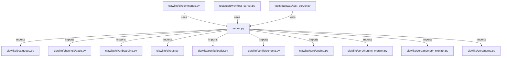

# CONNECTIONS clawlite/gateway/server.py

## Relationship Summary

- Imports 45 internal file(s).
- Imported by 2 internal file(s).
- Matched test files: 1.

## Internal Imports

- `clawlite/bus/queue.py`
- `clawlite/channels/base.py`
- `clawlite/cli/onboarding.py`
- `clawlite/cli/ops.py`
- `clawlite/config/loader.py`
- `clawlite/config/schema.py`
- `clawlite/core/engine.py`
- `clawlite/core/huginn_muninn.py`
- `clawlite/core/memory_monitor.py`
- `clawlite/core/norns.py`
- `clawlite/core/runestone.py`
- `clawlite/gateway/autonomy_notice.py`
- `clawlite/gateway/background_runners.py`
- `clawlite/gateway/control_handlers.py`
- `clawlite/gateway/control_plane.py`
- `clawlite/gateway/dashboard_runtime.py`
- `clawlite/gateway/dashboard_state.py`
- `clawlite/gateway/diagnostics_payload.py`
- `clawlite/gateway/engine_diagnostics.py`
- `clawlite/gateway/lifecycle_runtime.py`
- `clawlite/gateway/memory_dashboard.py`
- `clawlite/gateway/payloads.py`
- `clawlite/gateway/request_handlers.py`
- `clawlite/gateway/runtime_builder.py`
- `clawlite/gateway/runtime_state.py`
- `clawlite/gateway/status_handlers.py`
- `clawlite/gateway/subagents_runtime.py`
- `clawlite/gateway/supervisor_recovery.py`
- `clawlite/gateway/supervisor_runtime.py`
- `clawlite/gateway/tool_catalog.py`
- `clawlite/gateway/tuning_decisions.py`
- `clawlite/gateway/tuning_loop.py`
- `clawlite/gateway/tuning_policy.py`
- `clawlite/gateway/tuning_runtime.py`
- `clawlite/gateway/webhooks.py`
- `clawlite/gateway/websocket_handlers.py`
- `clawlite/providers/__init__.py`
- `clawlite/providers/catalog.py`
- `clawlite/providers/reliability.py`
- `clawlite/runtime/__init__.py`
- `clawlite/runtime/gjallarhorn.py`
- `clawlite/runtime/valkyrie.py`
- `clawlite/runtime/volva.py`
- `clawlite/scheduler/heartbeat.py`
- `clawlite/utils/logging.py`

## Reverse Dependencies

- `clawlite/cli/commands.py`
- `tests/gateway/test_server.py`

## Matching Tests

- `tests/gateway/test_server.py`

## Mermaid

