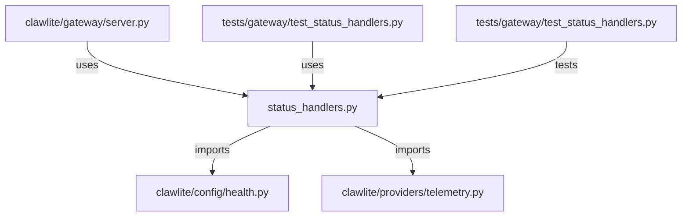

# CONNECTIONS clawlite/gateway/status_handlers.py

## Relationship Summary

- Imports 2 internal file(s).
- Imported by 2 internal file(s).
- Matched test files: 1.

## Internal Imports

- `clawlite/config/health.py`
- `clawlite/providers/telemetry.py`

## Reverse Dependencies

- `clawlite/gateway/server.py`
- `tests/gateway/test_status_handlers.py`

## Matching Tests

- `tests/gateway/test_status_handlers.py`

## Mermaid

