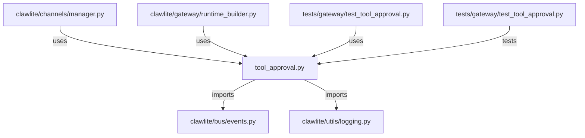

# CONNECTIONS clawlite/gateway/tool_approval.py

## Relationship Summary

- Imports 2 internal file(s).
- Imported by 3 internal file(s).
- Matched test files: 1.

## Internal Imports

- `clawlite/bus/events.py`
- `clawlite/utils/logging.py`

## Reverse Dependencies

- `clawlite/channels/manager.py`
- `clawlite/gateway/runtime_builder.py`
- `tests/gateway/test_tool_approval.py`

## Matching Tests

- `tests/gateway/test_tool_approval.py`

## Mermaid

