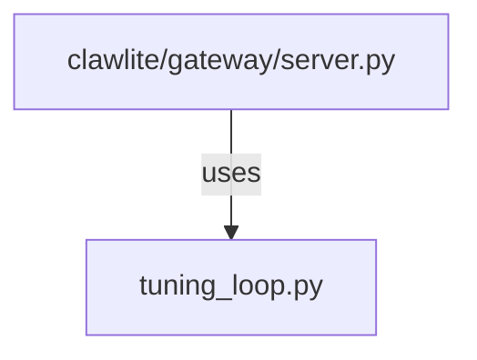

# CONNECTIONS clawlite/gateway/tuning_loop.py

## Relationship Summary

- Imports 0 internal file(s).
- Imported by 1 internal file(s).
- Matched test files: 0.

## Reverse Dependencies

- `clawlite/gateway/server.py`

## Mermaid

