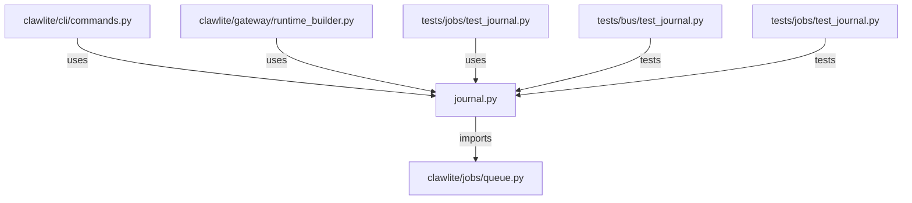

# CONNECTIONS clawlite/jobs/journal.py

## Relationship Summary

- Imports 1 internal file(s).
- Imported by 3 internal file(s).
- Matched test files: 2.

## Internal Imports

- `clawlite/jobs/queue.py`

## Reverse Dependencies

- `clawlite/cli/commands.py`
- `clawlite/gateway/runtime_builder.py`
- `tests/jobs/test_journal.py`

## Matching Tests

- `tests/bus/test_journal.py`
- `tests/jobs/test_journal.py`

## Mermaid

