# CONNECTIONS clawlite/jobs/queue.py

## Relationship Summary

- Imports 0 internal file(s).
- Imported by 8 internal file(s).
- Matched test files: 3.

## Reverse Dependencies

- `clawlite/gateway/runtime_builder.py`
- `clawlite/jobs/journal.py`
- `clawlite/tools/jobs.py`
- `tests/jobs/test_journal.py`
- `tests/jobs/test_queue.py`
- `tests/jobs/test_worker_status.py`
- `tests/runtime/test_supervisor_phase5.py`
- `tests/tools/test_jobs_tool.py`

## Matching Tests

- `tests/bus/test_queue.py`
- `tests/bus/test_redis_queue.py`
- `tests/jobs/test_queue.py`

## Mermaid

```mermaid
flowchart TD
    N0["queue.py"]
    R1["clawlite/gateway/runtime_builder.py"]
    R2["clawlite/jobs/journal.py"]
    R3["clawlite/tools/jobs.py"]
    R4["tests/jobs/test_journal.py"]
    R5["tests/jobs/test_queue.py"]
    R6["tests/jobs/test_worker_status.py"]
    R7["tests/runtime/test_supervisor_phase5.py"]
    R8["tests/tools/test_jobs_tool.py"]
    T1["tests/bus/test_queue.py"]
    T2["tests/bus/test_redis_queue.py"]
    T3["tests/jobs/test_queue.py"]
    R1 -->|uses| N0
    R2 -->|uses| N0
    R3 -->|uses| N0
    R4 -->|uses| N0
    R5 -->|uses| N0
    R6 -->|uses| N0
    R7 -->|uses| N0
    R8 -->|uses| N0
    T1 -->|tests| N0
    T2 -->|tests| N0
    T3 -->|tests| N0
```

