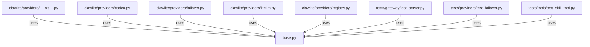

# CONNECTIONS clawlite/providers/base.py

## Relationship Summary

- Imports 0 internal file(s).
- Imported by 8 internal file(s).
- Matched test files: 0.

## Reverse Dependencies

- `clawlite/providers/__init__.py`
- `clawlite/providers/codex.py`
- `clawlite/providers/failover.py`
- `clawlite/providers/litellm.py`
- `clawlite/providers/registry.py`
- `tests/gateway/test_server.py`
- `tests/providers/test_failover.py`
- `tests/tools/test_skill_tool.py`

## Mermaid

