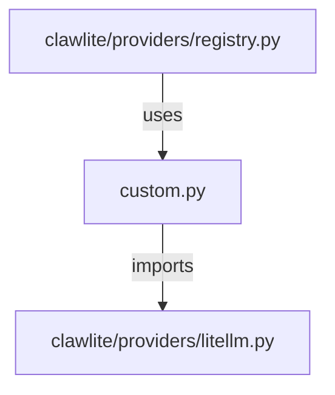

# CONNECTIONS clawlite/providers/custom.py

## Relationship Summary

- Imports 1 internal file(s).
- Imported by 1 internal file(s).
- Matched test files: 0.

## Internal Imports

- `clawlite/providers/litellm.py`

## Reverse Dependencies

- `clawlite/providers/registry.py`

## Mermaid

