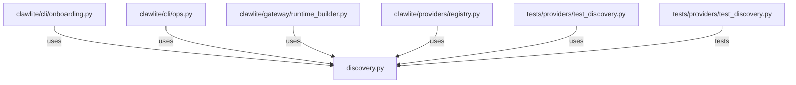

# CONNECTIONS clawlite/providers/discovery.py

## Relationship Summary

- Imports 0 internal file(s).
- Imported by 5 internal file(s).
- Matched test files: 1.

## Reverse Dependencies

- `clawlite/cli/onboarding.py`
- `clawlite/cli/ops.py`
- `clawlite/gateway/runtime_builder.py`
- `clawlite/providers/registry.py`
- `tests/providers/test_discovery.py`

## Matching Tests

- `tests/providers/test_discovery.py`

## Mermaid

