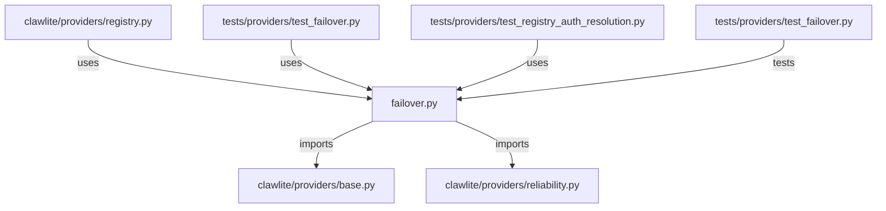

# CONNECTIONS clawlite/providers/failover.py

## Relationship Summary

- Imports 2 internal file(s).
- Imported by 3 internal file(s).
- Matched test files: 1.

## Internal Imports

- `clawlite/providers/base.py`
- `clawlite/providers/reliability.py`

## Reverse Dependencies

- `clawlite/providers/registry.py`
- `tests/providers/test_failover.py`
- `tests/providers/test_registry_auth_resolution.py`

## Matching Tests

- `tests/providers/test_failover.py`

## Mermaid

