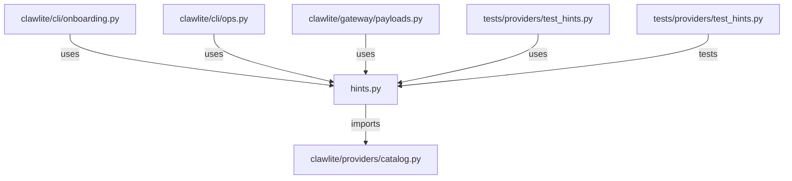

# CONNECTIONS clawlite/providers/hints.py

## Relationship Summary

- Imports 1 internal file(s).
- Imported by 4 internal file(s).
- Matched test files: 1.

## Internal Imports

- `clawlite/providers/catalog.py`

## Reverse Dependencies

- `clawlite/cli/onboarding.py`
- `clawlite/cli/ops.py`
- `clawlite/gateway/payloads.py`
- `tests/providers/test_hints.py`

## Matching Tests

- `tests/providers/test_hints.py`

## Mermaid

