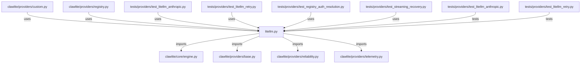

# CONNECTIONS clawlite/providers/litellm.py

## Relationship Summary

- Imports 4 internal file(s).
- Imported by 6 internal file(s).
- Matched test files: 2.

## Internal Imports

- `clawlite/core/engine.py`
- `clawlite/providers/base.py`
- `clawlite/providers/reliability.py`
- `clawlite/providers/telemetry.py`

## Reverse Dependencies

- `clawlite/providers/custom.py`
- `clawlite/providers/registry.py`
- `tests/providers/test_litellm_anthropic.py`
- `tests/providers/test_litellm_retry.py`
- `tests/providers/test_registry_auth_resolution.py`
- `tests/providers/test_streaming_recovery.py`

## Matching Tests

- `tests/providers/test_litellm_anthropic.py`
- `tests/providers/test_litellm_retry.py`

## Mermaid

