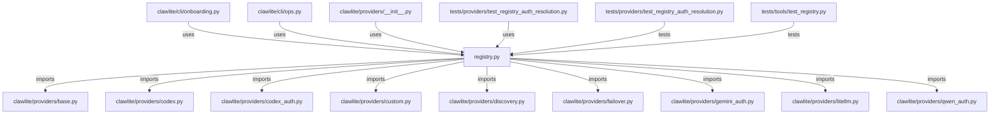

# CONNECTIONS clawlite/providers/registry.py

## Relationship Summary

- Imports 9 internal file(s).
- Imported by 4 internal file(s).
- Matched test files: 2.

## Internal Imports

- `clawlite/providers/base.py`
- `clawlite/providers/codex.py`
- `clawlite/providers/codex_auth.py`
- `clawlite/providers/custom.py`
- `clawlite/providers/discovery.py`
- `clawlite/providers/failover.py`
- `clawlite/providers/gemini_auth.py`
- `clawlite/providers/litellm.py`
- `clawlite/providers/qwen_auth.py`

## Reverse Dependencies

- `clawlite/cli/onboarding.py`
- `clawlite/cli/ops.py`
- `clawlite/providers/__init__.py`
- `tests/providers/test_registry_auth_resolution.py`

## Matching Tests

- `tests/providers/test_registry_auth_resolution.py`
- `tests/tools/test_registry.py`

## Mermaid

