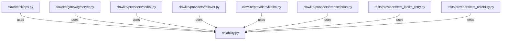

# CONNECTIONS clawlite/providers/reliability.py

## Relationship Summary

- Imports 0 internal file(s).
- Imported by 7 internal file(s).
- Matched test files: 1.

## Reverse Dependencies

- `clawlite/cli/ops.py`
- `clawlite/gateway/server.py`
- `clawlite/providers/codex.py`
- `clawlite/providers/failover.py`
- `clawlite/providers/litellm.py`
- `clawlite/providers/transcription.py`
- `tests/providers/test_litellm_retry.py`

## Matching Tests

- `tests/providers/test_reliability.py`

## Mermaid

