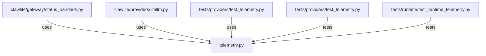

# CONNECTIONS clawlite/providers/telemetry.py

## Relationship Summary

- Imports 0 internal file(s).
- Imported by 3 internal file(s).
- Matched test files: 2.

## Reverse Dependencies

- `clawlite/gateway/status_handlers.py`
- `clawlite/providers/litellm.py`
- `tests/providers/test_telemetry.py`

## Matching Tests

- `tests/providers/test_telemetry.py`
- `tests/runtime/test_runtime_telemetry.py`

## Mermaid

